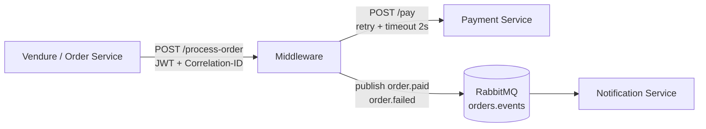

# Relatório Técnico — Middleware Distribuído

**Disciplina:** Arquitetura de Sistemas — 2º GQ 2026.1
**Professor:** Pedro Ximenes
**Universidade:** UNICAP

**Grupo:** _(definir)_
**Integrantes:**
- _(nome — matrícula)_
- _(nome — matrícula)_
- _(nome — matrícula)_
- _(nome — matrícula)_
- _(nome — matrícula)_
- _(nome — matrícula)_

**Domínio escolhido:** E-commerce (processamento de pedidos)
**Repositório:** _(URL GitHub/GitLab)_

> **Tamanho-alvo:** 3 a 6 páginas (slide 18 e slide 22 do enunciado).

---

## 1. Introdução

Este projeto implementa um **middleware distribuído** que orquestra a comunicação entre serviços independentes em um cenário de e-commerce. O middleware atua como camada central de coordenação, garantindo:

- comunicação síncrona (REST) e assíncrona (RabbitMQ);
- resiliência via retry + timeout + fallback;
- observabilidade com logs estruturados, correlation ID e métricas;
- segurança com JWT e autorização por papéis.

O foco da entrega é a **lógica de orquestração do middleware**, e não a complexidade do domínio de negócio (slide 4).

---

## 2. Arquitetura

### 2.1 Visão geral

```
Vendure / Order Service ──► Middleware ──► Payment Service
                                  │
                                  ▼
                              RabbitMQ (orders.events)
                                  │
                                  ▼
                          Notification Service
```

### 2.2 Componentes

| Componente | Responsabilidade | Stack |
|------------|------------------|-------|
| **Vendure** (ou stub) | Fonte de pedidos. Dispara `OrderStateTransitionEvent` que vira `POST /process-order`. | Vendure (TS) |
| **Middleware** | Núcleo da arquitetura. Recebe pedidos, valida JWT, propaga correlation ID, chama Payment Service com retry/timeout/fallback, publica evento na fila. | NestJS (TS) |
| **Payment Service** | Stub simulado. Aprova/recusa pagamento. Pode ser configurado para falhar (`FAILURE_RATE`) ou atrasar (`LATENCY_MS`) para demonstração. | NestJS (TS) |
| **RabbitMQ** | Broker de eventos. Exchange `orders.events` com routing keys `order.paid` / `order.failed`. | RabbitMQ 3 |
| **Notification Service** | Consumer da fila. Loga eventos com correlation ID propagado. | NestJS (TS) |
| **Postgres** | Banco do Vendure. | Postgres 16 |

### 2.3 Diagrama de arquitetura

> Inserir aqui a imagem `diagrama-arquitetura.png` (ou `.drawio.svg`). Sugestão: Excalidraw, draw.io, Mermaid.



---

## 3. Decisões Técnicas

### 3.1 Linguagem e framework

- **TypeScript + NestJS** em todos os serviços.
- Justificativa: o serviço fonte (Vendure) já é em TS — manter um único stack reduz fricção, padroniza tooling e DI nativa.
- Trade-off: NestJS adiciona boilerplate (módulos, decorators) em troca de DI, guards/interceptors prontos e estrutura padronizada.

### 3.2 Comunicação síncrona

- **REST** entre Vendure → Middleware → Payment Service.
- Endpoints documentados na seção 6 e 7 do `contexto-geral.md`.
- Status codes mapeados: 200 (sucesso), 401 (auth), 500 (erro).

### 3.3 Comunicação assíncrona

- **RabbitMQ** com exchange tipo `topic` (`orders.events`).
- Routing keys `order.paid` e `order.failed` permitem que o consumer filtre por tipo de evento.
- Lib: `@golevelup/nestjs-rabbitmq` (decorator `@RabbitSubscribe` simplifica o consumer).

### 3.4 Resiliência

- **Retry:** 3 tentativas com backoff exponencial 1s → 2s → 4s (`p-retry`).
- **Timeout:** 2 segundos por chamada HTTP (`axios timeout`).
- **Fallback:** se todas as tentativas falharem, retorna `status: PENDING` em vez de propagar erro.
- _(opcional)_ Circuit breaker com `opossum` para futuras versões.

### 3.5 Observabilidade

- **Logs:** `pino` em formato JSON estruturado, com campos `correlation_id`, `service`, `event`, `status`.
- **Correlation ID:** gerado no interceptor (`uuid v4`) se ausente; propagado em headers HTTP e payload da fila.
- **Métricas:** endpoint `/metrics` retornando contadores de requests, erros e latência média (via `prom-client`).

### 3.6 Segurança

- **JWT:** validado por `JwtAuthGuard` em todo endpoint protegido.
- **Roles:** `USER` (cria pedidos) e `ADMIN` (acesso completo), via `RolesGuard` + `@Roles(...)`.
- Secret configurado via env (`JWT_SECRET`).

### 3.7 Tolerância a falhas

| Cenário | Comportamento |
|---------|---------------|
| Payment Service indisponível | Retry 3× → fallback `PENDING` → publica `order.failed` |
| RabbitMQ indisponível | Log de erro + tentativa posterior (backoff) |
| Vendure indisponível | Sem efeito no middleware (não chega request) |
| Middleware indisponível | Vendure recebe erro do plugin (loga, não bloqueia o pedido) |

**Estratégia de consistência:** **eventual**. O sistema prioriza disponibilidade — se Payment estiver fora, o pedido fica em `PENDING` e é resolvido posteriormente. Trade-off conhecido: cliente pode receber confirmação de "pedido em análise" em vez de aprovado/recusado imediato.

### 3.8 Containerização

- 5 containers (Postgres, RabbitMQ, Vendure, Middleware, Payment, Notification).
- Healthchecks no Postgres e RabbitMQ; demais serviços usam `depends_on: condition: service_healthy`.
- Variáveis de ambiente externalizadas no `docker-compose.yml`.

---

## 4. Demonstração e Validação

### 4.1 Fluxo feliz

1. Pedido criado no Vendure → plugin dispara `POST /process-order`.
2. Middleware autentica, gera correlation ID, chama Payment.
3. Payment aprova → middleware publica `order.paid`.
4. Notification consome e loga.

### 4.2 Cenário de falha (slide 13 do enunciado — bônus +0,2)

1. Subir o stack: `docker compose up -d`.
2. Criar pedido (request autenticado).
3. **Derrubar Payment Service:** `docker compose stop payment-service`.
4. Repetir o pedido.
5. Logs mostram: 3 tentativas com backoff, fallback para `PENDING`, publish em `order.failed`, consumer logando.
6. Religar: `docker compose start payment-service`.

### 4.3 Métricas

- `GET /metrics` retorna número de requests, erros e latência média.

---

## 5. Dificuldades e Lições Aprendidas

> Esta seção deve ser preenchida pela equipe ao final do projeto. Itens sugeridos:

- **Configuração inicial:** pasta sob OneDrive causou EBUSY ao deletar `node_modules`. Lição: manter projetos com `node_modules` fora de pastas sincronizadas.
- **Escolha de stack:** discussão sobre Express puro vs NestJS — escolhido NestJS pela DI e guards prontos.
- **Vendure como fonte:** trade-off entre realismo (Vendure real) e simplicidade (stub). _(escolha final aqui)_
- **RabbitMQ + NestJS:** uso de `@golevelup/nestjs-rabbitmq` simplificou consumer.
- _(adicionar dificuldades reais ao longo do desenvolvimento)_

---

## 6. Divisão do Trabalho

| Pessoa | Área | Entregáveis |
|--------|------|-------------|
| Pessoa 1 | Core Middleware | `OrderController`, `OrderService`, fluxo principal |
| Pessoa 2 | Resiliência + HTTP | `PaymentClient` com retry/timeout/fallback |
| Pessoa 3 | Mensageria | `PublisherService`, `NotificationConsumer`, RabbitMQ |
| Pessoa 4 | Observabilidade | Logs pino, correlation interceptor, `/metrics` |
| Pessoa 5 | Segurança | `JwtAuthGuard`, `RolesGuard`, `@Roles` |
| Pessoa 6 | Integração + Infra | Vendure plugin, `docker-compose.yml`, ambiente |

---

## 7. Uso de IA / LLM

Conforme exigido no slide 8 do enunciado, a declaração detalhada do uso de IA está em [docs/uso-de-ia.md](uso-de-ia.md).

**Resumo:** Claude Opus 4.7 (Anthropic) foi usado para scaffolding do projeto, configuração de Docker/NestJS, formatação de documentação e revisão de aderência aos requisitos. **A lógica de negócio e implementação efetiva foi feita pela equipe.**

---

## 8. Conclusão

> Preencher ao final. Estrutura sugerida:

- O middleware atende aos 6 critérios obrigatórios da rubrica (slide 20).
- Bônus alcançados: _(listar — ex: idempotência, mais de 1 mecanismo de resiliência, tracing distribuído, dashboard Grafana)_.
- Principais aprendizados: _(2-3 frases)_.
- Limitações conhecidas: _(2-3 frases honestas)_.

---

## Anexos

- [contexto-geral.md](contexto-geral.md) — especificação técnica completa
- [divisão-atividades.md](divisão-atividades.md) — divisão detalhada por pessoa
- [uso-de-ia.md](uso-de-ia.md) — declaração de uso de IA
- [diagrama-arquitetura.png](#) — _(adicionar)_
- [README.md](../README.md) — instruções de execução
